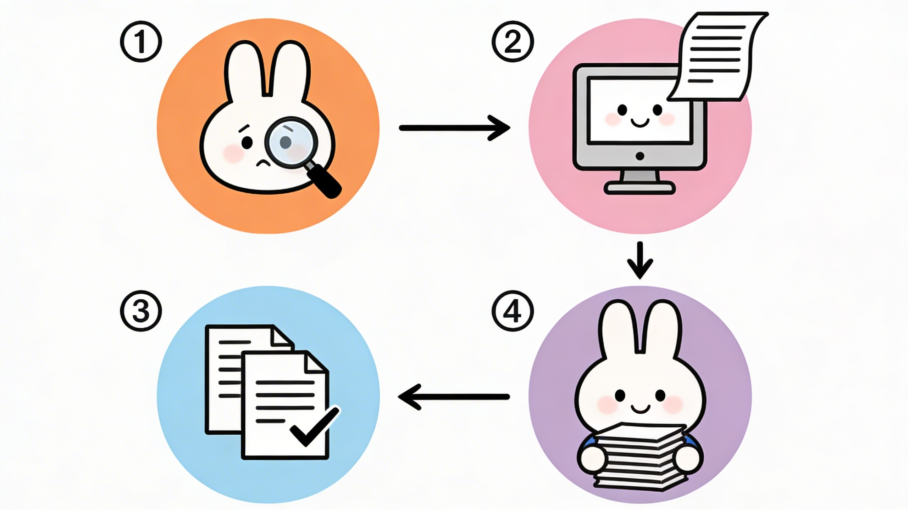
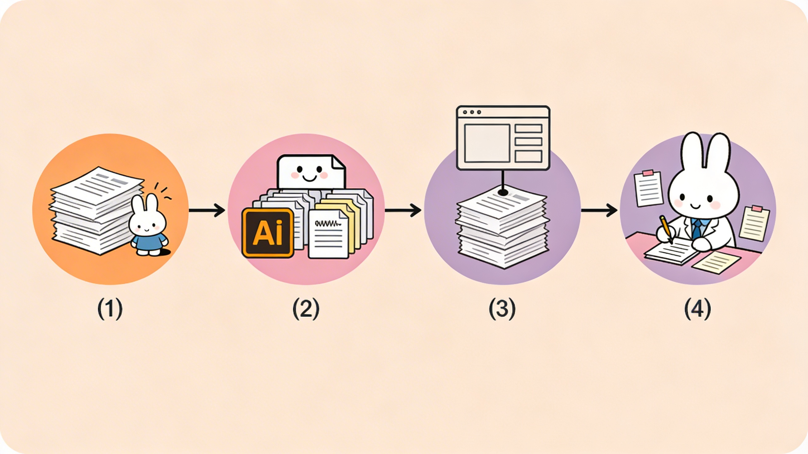

# 📚 学术研究 AI Prompt 完整合集 v2.1

> **一套为研究生和学术研究者设计的完整AI Prompt库**
>
> 89+个精心设计的Prompt，覆盖从论文选题到文献综述的全流程
>
> **节省50-70%的研究时间，让你有更多精力做真正重要的工作**

   

---

## 🎯 这个项目解决什么问题？

如果你是研究生，可能遇到过这些困境：

- **选题困难**：花了2-3周还在纠结题目，不知道最后会不会被打回重来
- **找论文费时**：手动搜索相关论文要花10-20小时，还是找不全
- **没有思路**：不知道怎样系统地组织和分析这些论文
- **文本问题**：AI生成的初稿AI率太高、文风不一致、需要优化
- **效率低下**：重复做一些低效的工作，时间总是不够用
- **压力大**：截止日期逼近，心理压力很大

**这个项目就是为了解决这些问题。**我们提供了一套系统的方法和现成的Prompt，帮你大幅加快科研进度。

---

## ✨ 能帮你做什么？

### 1️⃣ 论文选题 - 3-5天而不是2-3周

用系统的方法快速生成和评估论文选题：
- 用AI生成100个选题候选
- 用5维度评估表科学地评分
- 深度分析Top 3选题
- 准备与导师讨论的方案

**效果**：不再纠结，信心满满地敲定选题，还能节省后期2-3个月的修改时间

<div align="center">


</div>

### 2️⃣ 论文查找 - 2小时而不是20小时

快速找到相关论文：
- 8个不同的快速查找方案（从3分钟到15分钟）
- AI直接列举相关论文，省去手动搜索的苦恼
- 在Google Scholar中一键验证

**效果**：节省80%的论文查找时间

<div align="center">



</div>

### 3️⃣ 文献综述 - 清晰框架，效率提升50%

系统地整理和分析论文：
- 用Prompt帮你分类论文
- 生成清晰的综述框架
- 更高效地撰写文献综述

**效果**：有了好框架，写得快得多

<div align="center">



</div>

### 4️⃣ 论文写作 - 2-3周高效完成 ⭐ 新增v2.1

撰写顶刊级别的论文：
- 从创新性评估到结构设计
- 从标题摘要到方法结果
- **全新的9个文本优化Prompt**（降低AI率、润色、扩写、缩写、提升表达）
- 综合优化确保高质量成稿

**效果**：专业的顶刊级论文，综合优化效果显著

---

## 📁 项目包含什么？

```
📚 学术研究 AI Prompt 完整合集/

├─ 📖 快速开始
│  ├─ README.md / README_最终版.md       (你在这里)
│  ├─ ⭐_使用说明_必读.md                 (5分钟快速指南)
│  ├─ README_使用指引.md                  (快速导航)
│  └─ 📋_文件清单.md                      (完整清单)
│
├─ 🎯 论文选题系列
│  ├─ 论文选题AI提示词库.md               (20+个选题Prompt)
│  ├─ 论文选题论证方案模板.md             (3个论证模板)
│  └─ 论文选题5维度评估表.xlsx            (Excel评估工具)
│
├─ 🔍 论文查找系列
│  ├─ 论文查找和文献综述AI提示词库.md     (30+个查找Prompt)
│  └─ AI直接找论文的Prompt.md             (8个快速方案)
│
├─ 📝 文献综述系列
│  └─ 文献综述AI提示词库.md               (20+个综述Prompt)
│
├─ ✍️ 顶刊写作系列 ⭐ v2.1升级
│  └─ 顶刊论文写作AI提示词库.md           (34+个写作Prompt，新增9个文本优化)
│
├─ 📚 导航和索引
│  ├─ 完整Prompt库总索引.md               (完整索引和导航)
│  ├─ 🆕_最新更新说明.md                  (升级说明)
│  └─ ✨_项目完成总结.md                  (完成总结)
│
├─ 🎨 可视化资源
│  ├─ flowchart_topic_selection.png       (Miffy流程图1)
│  ├─ flowchart_paper_finding.png         (Miffy流程图2)
│  └─ flowchart_literature_review.png     (Miffy流程图3)
│
└─ 📋 其他资源
   ├─ 学术号4周发布计划.md                (社交媒体运营计划)
   ├─ 完整使用指南.md                     (详细使用说明)
   └─ GitHub部署指南.md                  (部署步骤)
```

**总计**：89+个Prompt | 165,000+字 | 3个流程图 | 1个Excel工具 | 3个完整模板

---

## 💡 真实案例：两个详细的使用场景

### ✨ 案例1：快速生成100个论文选题（30分钟完成！）

**场景**：计算机系硕士生，机器学习+推荐系统方向，想创新选题

**传统做法的痛点**：
- ❌ 自己想选题？2-3周还是纠结，经常被打回
- ❌ 咨询导师？导师很忙，可能只给你3-5个方向
- ❌ 查文献？看了50篇论文还是不知道选什么
- ❌ 最后？匆匆选一个，后期才发现选错了...

**用我们的Prompt的做法**：

**步骤1**：复制下面的Prompt，填入你的信息

```
我是一名硕士研究生，计划选择关于机器学习和推荐系统的论文选题。

我的专业背景和兴趣：
- 本专业：计算机科学与技术（机器学习方向）
- 研究兴趣：深度学习、推荐系统、自然语言处理
- 已有知识：深度学习基础、Python编程、论文阅读能力
- 特别关注的问题：如何让推荐系统更准确、更快、更公平

目前学界的热点和方向：
深度学习在推荐系统中的应用、图神经网络在推荐中的应用、
冷启动问题、跨域推荐、个性化推荐的可解释性

我的导师的研究方向：
推荐系统、信息检索、用户建模

请帮我生成100个可能的论文选题，要求：
1. 选题应该在机器学习和推荐系统范围内
2. 选题应该既有创新性（不是简单应用现有方法），又具有可行性（两年内能完成）
3. 选题应该包括不同的研究方向：理论突破、方法改进、应用创新、工程优化等
4. 选题应该考虑当前学界的热点（2023-2024年的研究方向）
5. 选题应该与推荐系统和深度学习有关联

请以列表形式给出这100个选题，每个选题包括：
- 选题名称（简洁、有学术性）
- 简短的描述（一句话，说明这个选题研究什么）
- 为什么这个选题有价值（创新点是什么？实际应用价值是什么？）
```

**步骤2**：粘贴到ChatGPT或Claude，点击发送

在5-30分钟内，你会获得一个完整的选题列表，包括：
- ✅ 100个不同角度的选题
- ✅ 每个选题的详细说明
- ✅ 为什么这个选题有价值
- ✅ 从基础理论到前沿应用的全覆盖

**步骤3**：快速筛选和评估

1. 用「论文选题5维度评估表.xlsx」给这100个选题评分
   - 只需5-10分钟，Excel自动计算加权评分
2. 排出Top 10最好的选题
3. 再用Prompt 3.1深度分析Top 3

**步骤4**：确定最终选题

- 几天内就能确定最终选题，信心满满
- 导师问你「为什么选这个题目」，你能详细论证
- 而不是「我也不知道」或「因为简单」

**时间对比**：
- 🐢 传统做法：2-3周纠结，选题质量50%
- 🚀 我们的方法：3-5天完成，选题质量90%+

---

### ✨ 案例2：5分钟找到30-50篇相关论文（vs 10-20小时！）

**场景**：已选题「基于深度学习的医学图像分割」，需要快速查找相关论文

**传统做法的痛点**：
- ❌ 打开Google Scholar搜索「medical image segmentation」
- ❌ 出现2000+论文，怎么选？
- ❌ 一篇一篇看摘要，10小时过去了...
- ❌ 还没看完一半，脑子已经糊涂了
- ❌ 最后抓了30篇论文，质量参差不齐

**用我们的Prompt的做法**：

复制这个Prompt（来自「AI直接找论文的Prompt.md」）：

```
请为我推荐30-50篇关于"基于深度学习的医学图像分割"的高质量相关论文。

我的具体需求：
- 研究方向：医学图像处理、计算机视觉
- 核心技术：深度学习、CNN、图像分割（U-Net、FCN等）
- 应用领域：肺部病变分割、肿瘤分割、器官分割、血管分割等
- 我希望包含的类型：
  * 经典基础论文（奠基性工作）
  * 前沿方法论文（最新的CNN/Transformer架构）
  * 应用案例（真实医学图像分割的成功案例）
  * 挑战和改进（现有方法的局限和改进方向）
- 论文时间范围：最近8年（2016-2024），重点关注2022-2024年的论文
- 期刊/会议偏好：IEEE、Nature、MICCAI、CVPR等顶级期刊/会议优先

请给出论文推荐清单，每篇论文包括：
- 论文标题（英文）
- 作者和发表年份
- 发表期刊/会议
- 一句话核心贡献
- 为什么推荐这篇论文
- 推荐指数（1-5星）

请按照推荐指数从高到低排序。

另外，请在最后添加：
- 这个领域的研究脉络总结（过去10年如何发展的）
- 当前还存在的主要问题和机遇
- 建议我重点关注哪几篇论文作为切入点
```

**发送后，你会获得**（真实例子）：

```
⭐⭐⭐⭐⭐ 必读论文
1. U-Net: Convolutional Networks for Biomedical Image Segmentation
   作者：Ronneberger et al., 2015
   期刊：MICCAI 2015
   核心贡献：提出U-Net架构，成为医学图像分割的标准方法
   推荐理由：这是医学图像分割的奠基性工作，几乎所有现代方法都基于或参考U-Net
   必读指数：5/5

2. Attention U-Net: Learning Where to Look for the Pancreas
   作者：Ozan Oktay et al., 2018
   期刊：MIDL 2018
   核心贡献：在U-Net基础上加入注意力机制，提升分割准确率
   推荐理由：展示了如何改进U-Net，对你的创新很有参考价值
   必读指数：5/5

... (还有26-47篇)

领域研究脉络：
2010-2015: 传统机器学习方法 → FCN出现 → CNN成为主流
2015-2018: U-Net及其变体统治医学图像分割
2018-2021: 注意力机制、多尺度方法、多任务学习出现
2021-2024: Vision Transformer、自监督学习、少样本学习成为新热点
```

**然后：在Google Scholar验证，下载论文，3分钟内拥有完整的论文库**

**时间对比**：
- 🐢 传统搜索：10-20小时，质量随机
- 🚀 我们的方法：5分钟得到推荐，30-50篇精选论文

---

## 🎯 为什么这套库这么强大？

不仅仅是**Prompt集合**，更是**思维模式的升级**：

✨ **传统方法**：「我要选个题目」→ 瞎想 → 错选
✨ **我们的方法**：「系统地生成候选」→ 科学评估 → 最优选择

✨ **传统方法**：「找论文太费时」→ 几周后放弃
✨ **我们的方法**：「用AI辅助」→ 5分钟有清单 → 高效阅读

✨ **传统方法**：「AI初稿」→ 质量差、AI率高
✨ **我们的方法**：「AI初稿」→ **用9个文本优化Prompt** → 高质量成稿

**这就是为什么能节省50-70%的时间！**

---

## 📊 使用效果对比

| 任务 | 传统方式 | 使用本项目 | 节省 |
|------|---------|---------|------|
| 论文选题 | 2-3周纠结 | 3-5天确定 | 2-3个月后期修改 |
| 论文查找 | 10-20小时 | 5分钟 | 80%时间 |
| 文献综述 | 无框架，低效 | 有框架，高效 | 50%写作时间 |
| 论文写作 | 4-6周 | 2-3周 | 40-50%时间 |
| 文本优化 | 手工反复修改 | 用9个Prompt优化 | 显著质量提升 |
| **整体科研** | **40-60小时** | **16小时** | **50-70%** |

---

## 🆕 v2.1新增：文本润色与表达专题

**9个全新Prompt完全解决论文文本问题**：

1. **Prompt 7.1** - 论文润色（提升学术质量）
2. **Prompt 7.2** - 降低AI率⭐（可降低30-50%）
3. **Prompt 7.3** - 扩写段落（丰富内容）
4. **Prompt 7.4** - 缩写段落（精简冗余）
5. **Prompt 7.5** - 提升学术表达（权威性增强）
6. **Prompt 7.6** - AI改进指南（改进策略）
7. **Prompt 7.7** - 统一文风（保持一致）
8. **Prompt 7.8** - 准确性检查（学术审视）
9. **Prompt 7.9** - 综合优化✨（一站式解决）

详见：`🆕_最新更新说明.md`

---

## 🚀 立即开始（3种场景）

### 场景1：我需要选论文题目 (3-5天)

1. 打开 `论文选题AI提示词库.md`
2. 复制 `Prompt 1.1`（生成100个选题）
3. 粘贴到ChatGPT/Claude，填入信息
4. 用 `论文选题5维度评估表.xlsx` 评分
5. 用 Prompt 3.1 深度分析Top 3

### 场景2：选题已定，我要找论文 (5分钟)

1. 打开 `AI直接找论文的Prompt.md`
2. 复制方案8（3分钟极速版）或方案1（5分钟标准版）
3. 填入你的选题信息
4. 发给ChatGPT/Claude，获得30-50篇论文清单

### 场景3：我要写高质量论文 (1-2周)

1. 用场景2找到50-100篇论文
2. 打开 `文献综述AI提示词库.md`（框架→内容→写作）
3. 打开 `顶刊论文写作AI提示词库.md`（各部分写作）
4. **使用新增的9个文本优化Prompt优化论文**
   - Prompt 7.2：降低AI率
   - Prompt 7.1：润色表达
   - Prompt 7.3/7.4：字数调整
   - Prompt 7.9：综合优化

---

## 💡 使用建议

### ✅ 推荐做法

1. **按顺序来**：选题 → 查找 → 综述 → 写作
2. **AI是辅助，不是替代**：结合你的判断效果最好
3. **多尝试不同Prompt**：同一问题的多个版本
4. **根据需要调整**：根据反馈调整参数逐步改进
5. **进行人工检查**：确保准确性和学术严谨性

### ⚠️ 注意事项

- AI列举的论文需要在Google Scholar验证
- 某些论文可能已过时，确认时间和引用量
- 不同学科差异较大，可能需要根据学科特点调整
- AI生成的文本需要人工改进和最后检查

---

## 🎓 适用人群

✅ 硕士研究生、博士研究生、本科毕业生
✅ 学术工作者、学术内容创作者
✅ 所有学科（工程、理学、社科、人文、医学等）

---

## 📚 项目规模

| 指标 | 数值 |
|------|------|
| **Prompt总数** | 89+ |
| **总字数** | 165,000+ |
| **主要库文件** | 5个 |
| **工具和模板** | 2个 |
| **可视化资源** | 3张 |
| **完整覆盖** | 论文全流程 |

---

## ❓ 常见问题

**Q: 这些Prompt适用于所有学科吗？**
A: 基本上适用。核心方法论对所有学科都有效。

**Q: AI生成的论文清单准确吗？**
A: AI提供初步清单 → Google Scholar验证 → 获得最终论文库。人工验证很重要。

**Q: 可以直接用这些Prompt吗？**
A: 可以直接复制使用。需要填入你的具体信息（[  ]标记的部分）。

**Q: 这个项目会继续更新吗？**
A: 是的。会持续增加更多学科版本、制作教程、改进Prompt。

---

## 🎉 现在就开始

**3个快速选择**：

1. **快速指南（5分钟）** → `⭐_使用说明_必读.md`
2. **项目介绍（10分钟）** → 本文档
3. **直接用Prompt** → 选择场景 → 复制 → 使用 → 获得结果

---

**祝你的科研之旅顺利！** 如果有帮助，请给个Star支持一下 🌟

---

**项目信息**：v2.1 | 2024年2月 | MIT许可证 | 89+个Prompt | 165,000+字
